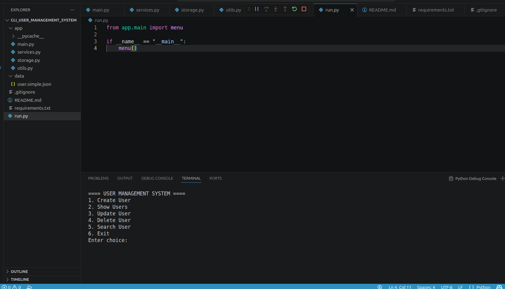
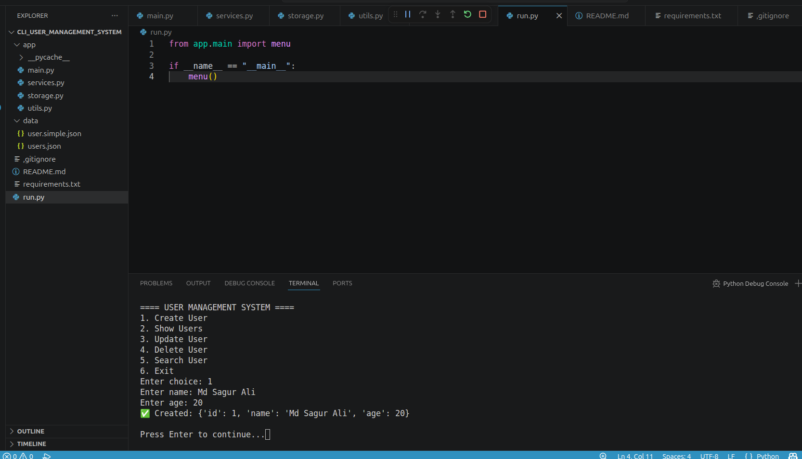
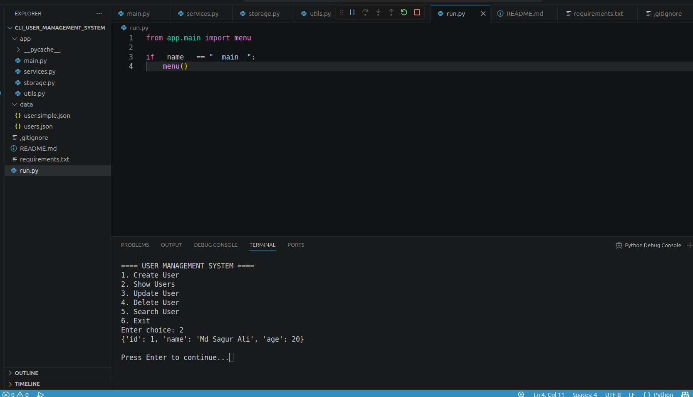
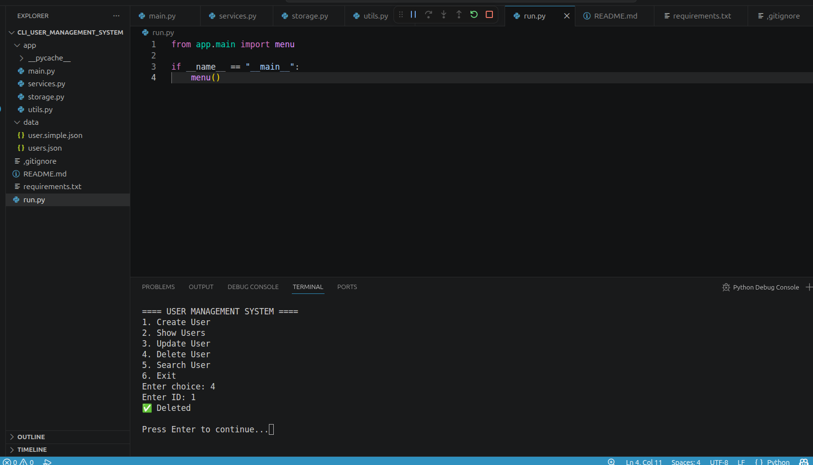
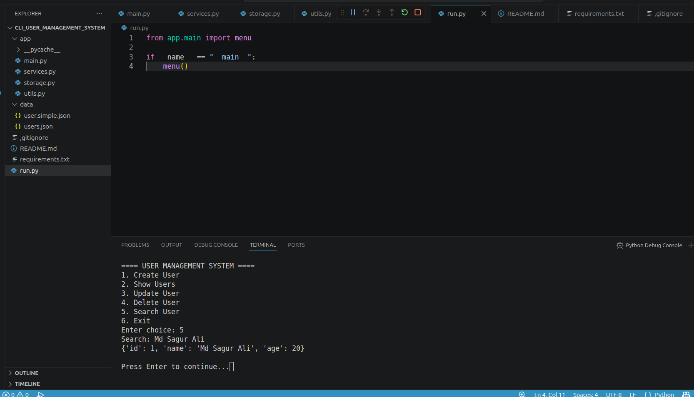
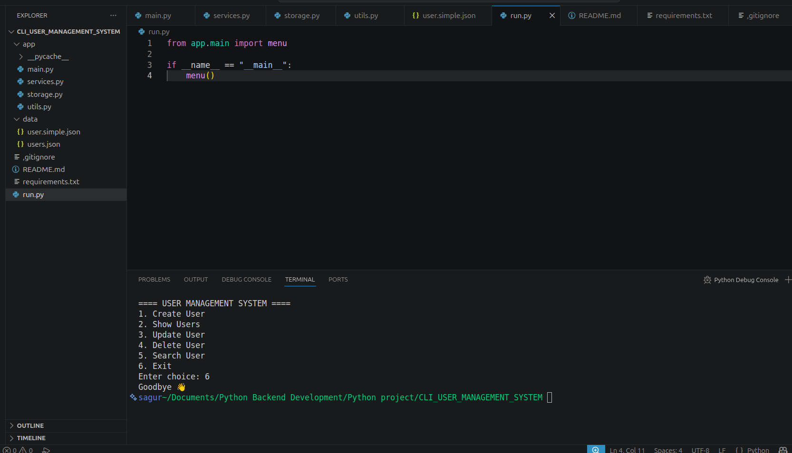

# CLI User Management System (Python)

## Overview

A backend-style CLI application built with Python that uses JSON file handling as a lightweight database.

This project demonstrates real-world backend concepts such as CRUD operations, modular architecture, and data persistence.

---

## Features

* Create User
* Show All Users
* Update User
* Delete User
* Search User
* CLI-based interface

---

## Tech Stack

* Python 3
* JSON (File-based storage)
* CLI (Command Line Interface)

---

## Project Structure

```
cli-user-management-system/
│
├── app/
│   ├── main.py        # CLI interface
│   ├── services.py    # business logic
│   ├── storage.py     # file handling
│   └── utils.py       # helper functions
│
├── data/
│   └── users.sample.json
│
├── run.py
├── README.md
├── requirements.txt
└── .gitignore
```

---

## How to Run

### 1. Clone the repository

```bash
git clone https://github.com/YOUR_USERNAME/cli-user-management-system.git
```

### 2. Navigate to the project directory

```bash
cd cli-user-management-system
```

### 3. Run the application

```bash
python run.py
```

---

## Notes

* `users.json` file will be created automatically during runtime
* Sample data is provided inside the `data/` folder

---

## Demo (CLI Output)

## 🖼️ Project Demo Screenshots

### Step-by-step CLI Flow















---

## Future Improvements

* Input validation
* UUID-based unique ID system
* Improved CLI UI (table format)
* Convert to REST API (Django / Flask)
* Add authentication system

---

## Author

**Md Sagur Ali**
Python Backend Developer (Django & DRF)
GitHub: https://github.com/sagur0239
